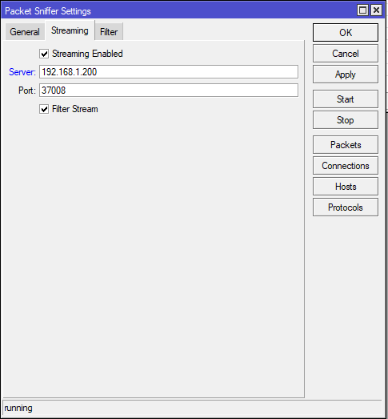

# Mikrotik Remote Capture

Mikrotik Remote packet capture


Problem definition: Mikrotik routers have a streaming packet capture feature (see below)

Via winbox:



Via the Mikrotik CLI:
```
/tool sniffer
set filter-interface=trunk-v0010 filter-ip-address=\
    10.16.16.15/32 filter-operator-between-entries=and filter-stream=yes \
    streaming-enabled=yes streaming-server=172.16.0.195
```

The simplest way to capture this stream is with tshark:

```bash
tshark -f "udp port 37008"
```

Or with automatic rotation:

```bash
tshark -f "udp port 37008" -w SIL-issues.pcap -b filesize:1048576
```

This leaves the TZSP headers in place however, to use more advanced tools you would want the strip those headers (Frame -> Ethernet -> IP -> UDP).


## Tools

* clean/ contains both a python and rust tools to remove the TZSP headers from an existing capture.
* tzsp_ng_capture/ is a rust program to capture directly off the wire and strip the header before writing to disk.

## Notes

* Underlying protocol - Tazmen Sniffer protocol